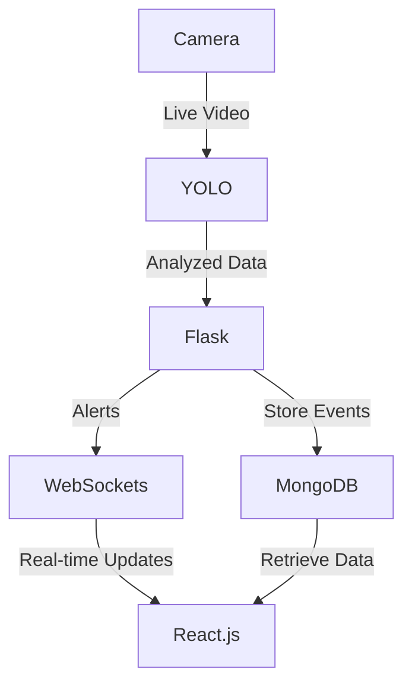

# 🚀 Crime Detection Model

## 🔍 Overview
The **Crime Detection Model** is an AI-powered real-time surveillance system that enhances public safety by detecting potential threats such as **guns and knives**. This system integrates modern technologies like **YOLO (You Only Look Once), OpenCV, Flask, Node.js, WebSockets, and MongoDB** to analyze live video feeds and provide **instant alerts**.

## ⚡ Features
✅ **Real-time Crime Detection** using YOLO and OpenCV  
✅ **Instant Alerts** via WebSockets communication  
✅ **Scalable Architecture** suitable for smart cities and law enforcement  
✅ **Dynamic Surveillance Management** (Add/Remove cameras)  
✅ **Cloud-Compatible** and efficient data handling  
✅ **User-Friendly Dashboard** built with React.js  

## 🛠️ Tech Stack
- **Backend:** Flask, Node.js, WebSockets
- **Frontend:** React.js
- **Database:** MongoDB
- **AI & Computer Vision:** YOLO, OpenCV
- **Communication:** WebSockets
- **Cloud-Ready:** Scalable and efficient

## 📌 Architecture


## 🚀 Installation & Setup
### 🔹 Prerequisites
Make sure you have **Python, Node.js, and MongoDB** installed on your system.

### 🔹 Clone the Repository
```sh
git clone https://github.com/harshsingh1112/AI-crime-detection.git
cd crime-detection-model
```

### 🔹 Backend Setup (Flask & AI Model)
```sh
cd backend
pip install -r requirements.txt
python app.py
```

### 🔹 Frontend Setup (React.js)
```sh
cd frontend
npm install
npm start
```

### 🔹 Database Setup (MongoDB)
Make sure MongoDB is running locally or on a cloud instance.

### 🔹 Node.js Server (WebSockets & API)
```sh
cd server
npm install
node index.js
```

## 📸 Demo
🚀 Coming soon...

## 🤝 Contributing
Contributions are welcome! Feel free to submit a PR or open an issue. 🙌

## 📜 License
This project is licensed under the **MIT License**.

## 📞 Contact
🔗 [LinkedIn](https://www.linkedin.com/in/harshsingh11)
📧 Email: harshsingh34418@gmail.com 
